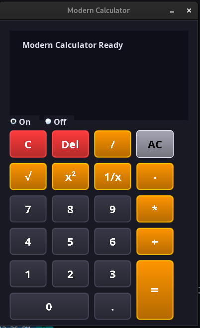

# Modern Calculator

A modern, visually attractive calculator application built with Java Swing, featuring beautiful styling and smooth animations.



## Features

- Clean, modern UI with beautiful styling and animations
- Basic arithmetic operations: addition, subtraction, multiplication, division
- Advanced operations: square, square root, reciprocal
- Decimal point support
- Clear/delete functionality
- Calculation history display
- On/Off functionality

## Requirements

- Java 8 or higher
- Any operating system that supports Java

## How to Run

1. Clone this repository:
   ```
   https://github.com/morteza-codi/projectGUI_in_java.git/calculator
   ```

2. Navigate to the project directory:
   ```
   cd calculator
   ```

3. Compile the Java file:
   ```
   javac src/OptimizedCalculator.java
   ```

4. Run the application:
   ```
   java -cp src OptimizedCalculator
   ```

## Usage

- **Numbers (0-9)**: Input numbers
- **Operators (+, -, *, /)**: Perform basic arithmetic operations
- **=**: Calculate the result
- **C**: Clear current input
- **Del**: Delete the last digit
- **AC**: Clear all (reset calculator)
- **x²**: Square the current number
- **√**: Calculate square root of the current number
- **1/x**: Calculate reciprocal of the current number
- **.**: Add decimal point
- **On/Off**: Toggle calculator power

## Project Structure

```
Calculator/
├── src/
│   ├── image/
│   │   └── Screenshot.png
│   └── OptimizedCalculator.java
├── README.md
├── LICENSE
└── .gitignore
```

## License

This project is licensed under the MIT License - see the [LICENSE](LICENSE) file for details.
