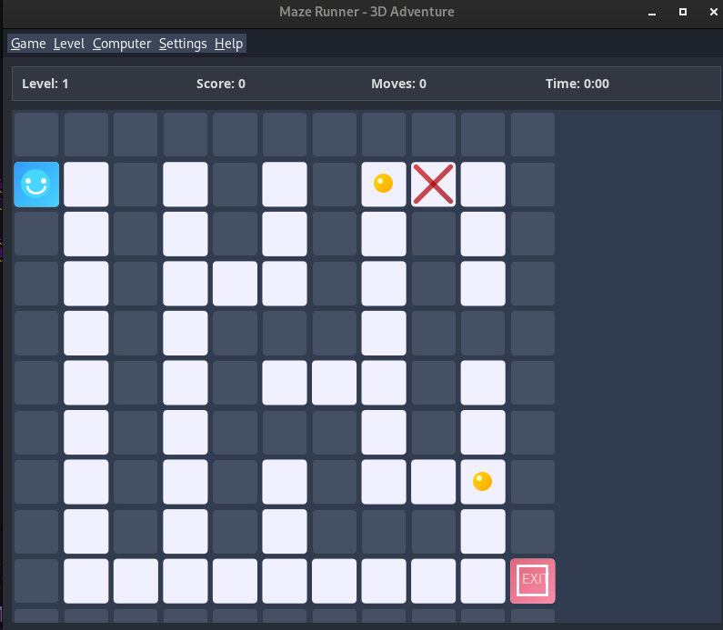

# Maze Runner 3D

A challenging maze game with beautiful graphics and multiple difficulty levels.



## Features

- Modern UI with attractive graphics
- Multiple difficulty levels (Easy, Medium, Hard, Expert)
- Player character with animations
- Collectible items and traps
- Score tracking system
- Timer to track your progress
- Hint system to help when stuck
- Auto-solve feature to see the solution
- Algorithm visualization to see how the maze is solved

## How to Play

### Controls
- **Arrow Keys** or **WASD** - Move the player
- **H** - Show hint
- **Ctrl+N** - New game
- **Ctrl+R** - Restart level
- **Ctrl+S** - Save game
- **Ctrl+L** - Load game
- **Ctrl+A** - Auto solve
- **Ctrl+D** - Show algorithm
- **Ctrl+Q** - Exit game

### Gameplay
1. Navigate through the maze using arrow keys or WASD
2. Collect items (gold coins) to increase your score
3. Avoid traps (red X marks) which decrease your score
4. Find the exit to complete the level
5. Progress through increasingly difficult mazes

## Technical Details

This game is built using Java Swing and follows object-oriented programming principles. The maze generation uses a randomized depth-first search algorithm to ensure each maze is solvable and unique.

### Project Structure
- `Main.java` - Main application class with UI components
- `Maze.java` - Maze generation and path-finding algorithms
- `MazePanel.java` - Rendering and game mechanics
- `Position.java` - Position tracking utility class

## Requirements

- Java Runtime Environment (JRE) 8 or higher
- Minimum screen resolution: 800x700

## Installation

1. Clone this repository:
   ```
   git clone https://github.com/morteza-codi/projectGUI_in_java.git/Maze_Game
   ```

2. Compile the source code:
   ```
   javac -d out/production/Maze_Game src/*.java
   ```

3. Run the game:
   ```
   java -cp out/production/Maze_Game Main
   ```

## License

This project is licensed under the MIT License - see the [LICENSE](LICENSE) file for details.

## Acknowledgments

- Created by Maze Runner Team
- Special thanks to all contributors
