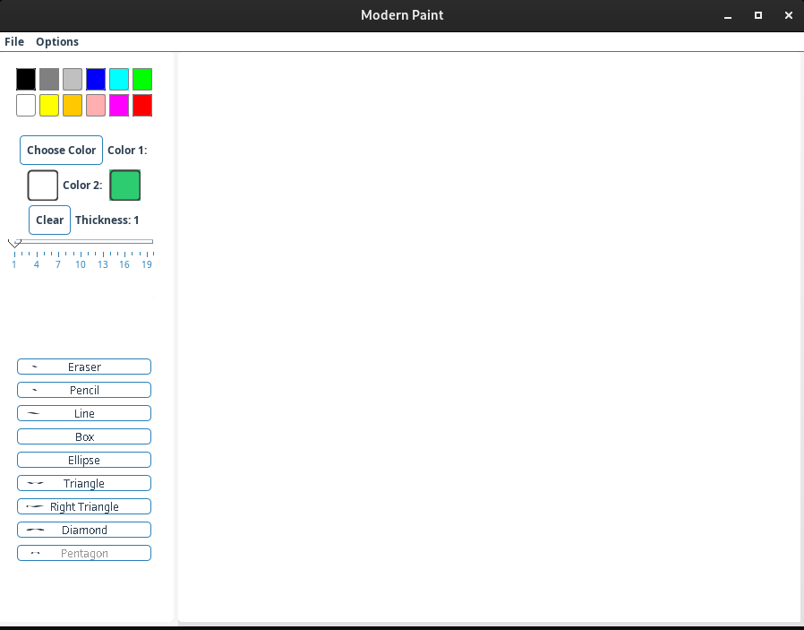

# Modern Paint Application

A beautiful Java-based paint application with a modern UI that allows users to draw various shapes and use different tools.



## Features

- **Modern UI**: Clean, modern interface with rounded corners and a pleasing color scheme
- **Drawing Tools**: Multiple drawing tools including:
  - Pencil
  - Eraser
  - Line
  - Box (Rectangle)
  - Ellipse
  - Triangle (Isosceles)
  - Right Triangle
  - Diamond
  - Pentagon
- **Color Selection**: Choose from preset colors or use a color picker for custom colors
- **Thickness Control**: Adjust line thickness with an intuitive slider
- **Fill Option**: Toggle fill mode for shapes
- **File Operations**: Save and load your drawings

## Requirements

- Java Development Kit (JDK) 8 or higher
- Any operating system that supports Java

## Installation

1. Clone this repository:
```
git clone https://github.com/morteza-codi/projectGUI_in_java.git/Paint
```

2. Navigate to the project directory:
```
cd Paint
```

3. Compile the project:
```
javac -d out/production/Paint src/*.java
```

4. Run the application:
```
java -cp out/production/Paint Main
```

## How to Use

1. **Select a Tool**: Click on any tool button from the left panel
2. **Choose Colors**: 
   - Select from the color palette
   - Use "Color 1" for primary color (outlines)
   - Use "Color 2" for secondary color (fills)
   - Click "Choose Color" for custom colors
3. **Adjust Thickness**: Use the slider to set line thickness
4. **Drawing**:
   - Click and drag on the canvas to draw
   - For shapes, click where you want to start and drag to define the shape size

## Project Structure

```
Paint/
├── src/
│   ├── ColorChooser.java
│   ├── CoordinateBar.java
│   ├── DrawFrame.java
│   ├── Main.java
│   ├── ModernLookAndFeel.java
│   ├── ModernUIComponents.java
│   ├── PaintControl.java
│   ├── PaintEnvironment.java
│   ├── PaintingComponent.java
│   ├── PaintPanel.java
│   ├── Shape.java
│   ├── ToolBar.java
│   └── ToolIcon.java
├── out/
│   └── production/
│       └── Paint/
└── README.md
```

## Contributing

Contributions are welcome! Please feel free to submit a Pull Request.

1. Fork the repository
2. Create your feature branch (`git checkout -b feature/amazing-feature`)
3. Commit your changes (`git commit -m 'Add some amazing feature'`)
4. Push to the branch (`git push origin feature/amazing-feature`)
5. Open a Pull Request

## License

This project is licensed under the MIT License - see the [LICENSE](LICENSE) file for details.

## Acknowledgments

- Inspired by classic paint applications with a modern twist
- Built with Java Swing for the UI components
