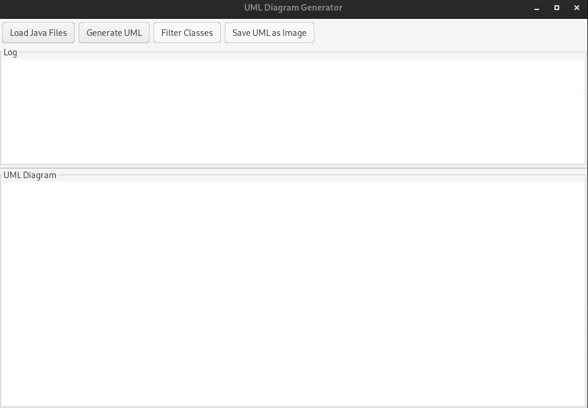

# UML Generator

A Java application for generating UML class diagrams from Java source files. This tool helps developers visualize the structure of their Java projects by automatically analyzing source code and creating interactive UML diagrams.

## Features

- **Load Java Files**: Import Java source files for analysis
- **Generate UML Diagrams**: Automatically create UML class diagrams showing classes, interfaces, and their relationships
- **Filter Classes**: Show/hide specific classes to focus on relevant parts of the diagram
- **Save as Image**: Export UML diagrams as PNG images
- **Interactive UI**: Smooth scrolling and navigation of large diagrams
- **Relationship Visualization**: Shows inheritance, implementation, association, and other relationships between classes

## Screenshots




## Requirements

- Java 8 or higher
- Swing (included in JDK)

## Installation

1. Clone this repository:
   ```
   https://github.com/morteza-codi/projectGUI_in_java.git/UML_Generator
   ```

2. Compile the source code:
   ```
   cd UML_Generator
   javac -d out/production/UML_Generetor src/*.java
   ```

3. Run the application:
   ```
   java -cp out/production/UML_Generetor UMLGenerator
   ```

## Usage

1. Launch the application
2. Click "Load Java Files" to select Java source files for analysis
3. Click "Generate UML" to create the diagram
4. Use "Filter Classes" to show/hide specific classes
5. Navigate the diagram using the scroll bars
6. Click "Save UML as Image" to export the diagram as a PNG file

## Project Structure

- `src/` - Source code files
  - `UMLGenerator.java` - Main application class and UI
  - `CodeAnalyzer.java` - Java source code parsing and analysis
  - `DiagramRenderer.java` - UML diagram rendering
  - `ClassInfo.java` - Class metadata storage
  - `AttributeInfo.java` - Class attribute metadata
  - `MethodInfo.java` - Class method metadata
  - `Relationship.java` - Class relationship representation
  - `RelationshipType.java` - Enumeration of relationship types

## Contributing

Contributions are welcome! Please feel free to submit a Pull Request.

## License

This project is licensed under the MIT License - see the LICENSE file for details.
